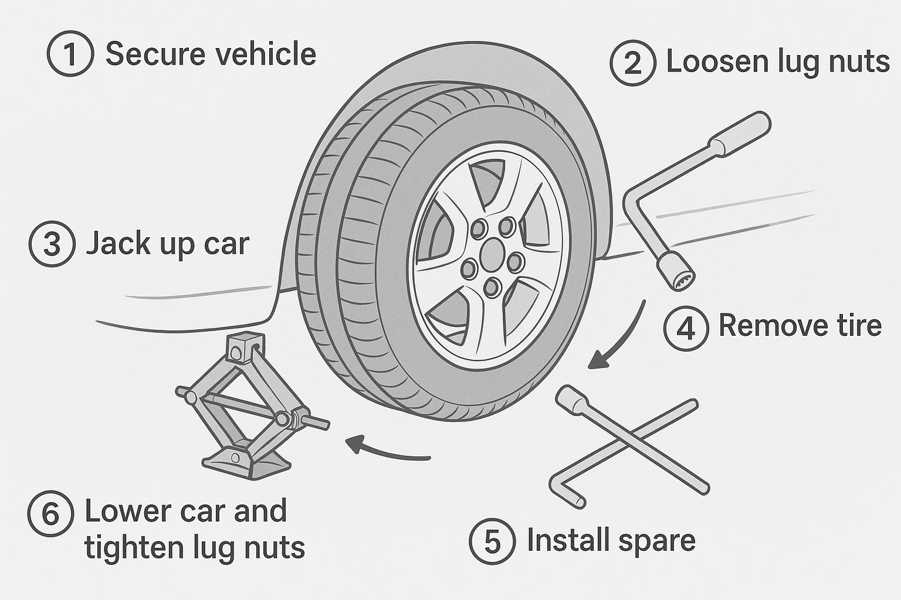
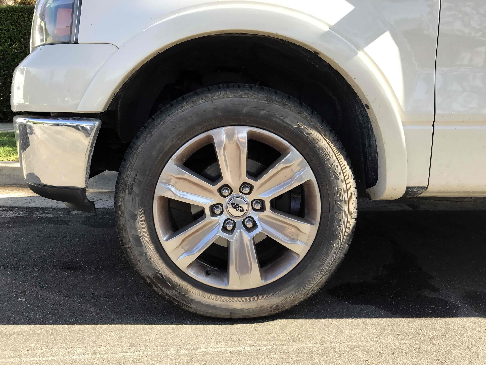
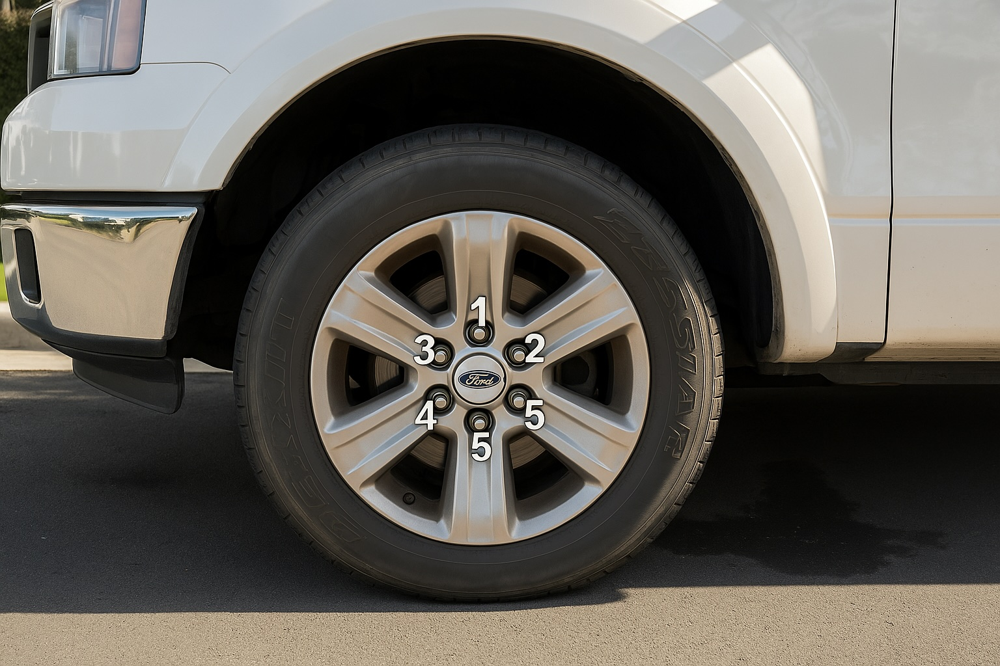

+++
title = "New GPT-4o: Image Generation for Everyone"
date = "2025-03-26T11:18:39+01:00"

tags = []
images = ["/image-gen-for-dummies.jpeg"]
+++

OpenAI's [updated](https://openai.com/index/introducing-4o-image-generation/) GPT-4o model now not only accepts images as inputs but also generates them. This update re-establishes OpenAI as a leader in image generation, especially after its previous model, DALL-E, had fallen behind [top players](https://x.com/ArtificialAnlys/status/1904188980423467472) like the startup [Reve](https://preview.reve.art/) and corporate rivals such as Google with their [Imagen 3](https://deepmind.google/technologies/imagen-3/) model.

The ability to output images is something I have seen requested many times by clients in their LLM-based projects. Many were surprised that such powerful models - capable of processing both audio and images - cannot currently output altered versions of those inputs. Leveraging its massive ChatGPT user base, OpenAI now addresses this limitation by offering the new model version to all users, [including](https://openai.com/index/introducing-4o-image-generation/#access-and-availability) those on the free tier.

Although impressive image generation models already exist, what sets Google's - and now OpenAI's - approach apart is its availability: The number of weekly ChatGPT users [surpassed 400M last month](https://www.reuters.com/technology/artificial-intelligence/openais-weekly-active-users-surpass-400-million-2025-02-20/). Moreover, companies already integrating LLMs often have existing partnerships with leading providers, making it easy for them to experiment with image generation without the hassle of establishing new agreements with niche vendors.

---

Since I'm a visual learner, I wanted to explore a use case where the model generates simple diagrams to guide readers through a series of steps.

### Example 1: Text to Image Generation

For this experiment, I aimed to generate a clear visual output that demonstrates the necessary tools and step-by-step instructions. In this instance, I asked for a diagram on how to change a tire.

(Best of 4)

Although the output still has a slightly cartoony style (which could be improved by refining the prompt), it not only accurately depicts all the relevant aspects of the task but also exhibits a solid semantic understanding of it: Correct steps are established (hardly impressive in today's state of LLMs), but they are also clearly and sequentially laid out in the image, providing a figure that describes the task visually using only a handful of words. 

### Example 2: Text + Image to Image Generation

A slightly different task involves combining a textual prompt with an existing image. Here, I asked the model to identify where the 'lug nuts' appear in the photo and to annotate each with a unique number.

#### Original Photo

#### Annotated Photo

(Best of 4)

Although this is a toy example, it clearly demonstrates the model's ability to both understand the content of an image and follow textual instructions simultaneously. What's interesting here is that the model leverages tokens rather than traditional diffusion methods[^1], essentially performing reasoning directly on the image. One can do transformations that conserve parts of the original. For instance, changing the background while keeping the subject unchanged.

That being said, the solution is not bullet-proof: Two of the lug nuts are labelled '5'. An interesting side-effect I have also observed is that the outputs are not 100% consistent with the inputs. As you can see in the example above, the photo is slightly altered and refined. For example, the car maker's logo appears rotated. That being said, input groundedness will certainly be improved upon in future updates.

---

Image reasoning opens up a range of applications. For example, this feature could serve as a Q&A tool that simultaneously identifies key elements in an image and applies relevant knowledge - all within a single request. Next example could be converting hand-drawn scribbles into presentation-ready computer graphics. Another potential application is accessibility, as LLMs can assist users with visual impairments by converting visual content into more accessible formats.

With over 400 million weekly ChatGPT users, it's clear that this new tool is already sparking innovative ideas. I anticipate that soon, a broader range of products will harness these accessible image generating and image understanding models.

### Side-note on Privacy
According to OpenAI's [system card](https://cdn.openai.com/11998be9-5319-4302-bfbf-1167e093f1fb/Native_Image_Generation_System_Card.pdf), the model **is not restricted** from generating content that includes adult public figures. Public figures who do not wish to have their likeness generated can opt out. I'm curious to see not only how this opt-out mechanism will work in practice and how effective it will be, but also what implications may arise from the ability to generate photorealistic content of public figures without their consent.

The [explore page on Sora](https://sora.com/explore)[^2], which features trending user-generated content, already showcases numerous realistic fakes of public figures as well as suggestive imagery involving women. This raises important questions about consent and the ethical use of photorealistic image generation.

[^1]: A diffusion model is an ML algorithm that generates high-quality data by progressively adding noise to a dataset and then learning to reverse this process to create new data. It works by turning an image into noise and then learning to turn that noise back into an image.
[^2]: Sora is OpenAI's AI model that generates videos from text prompts. Its website includes a gallery of user-generated content, including GPT-4o outputs.

